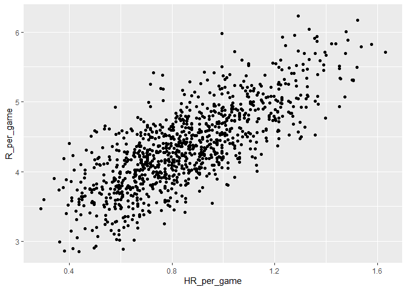
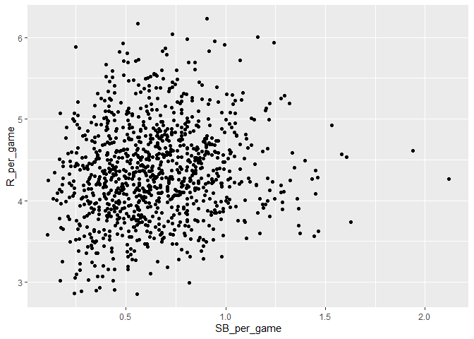
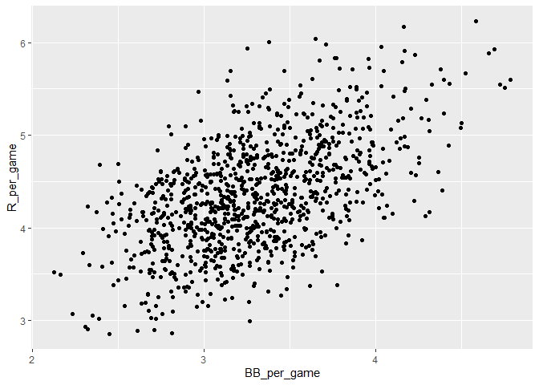
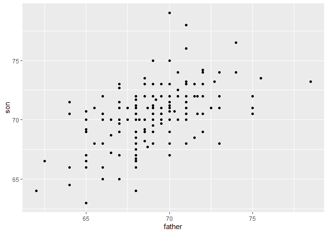
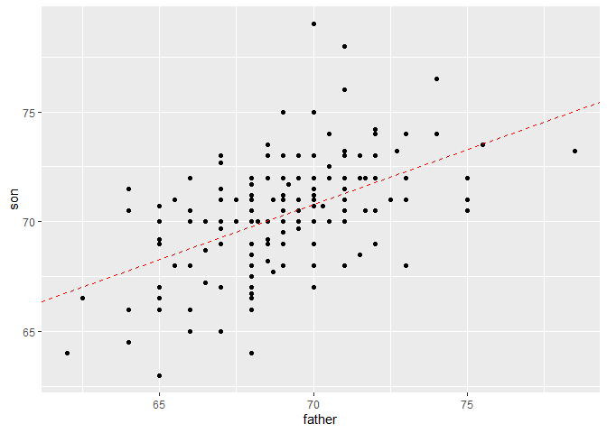
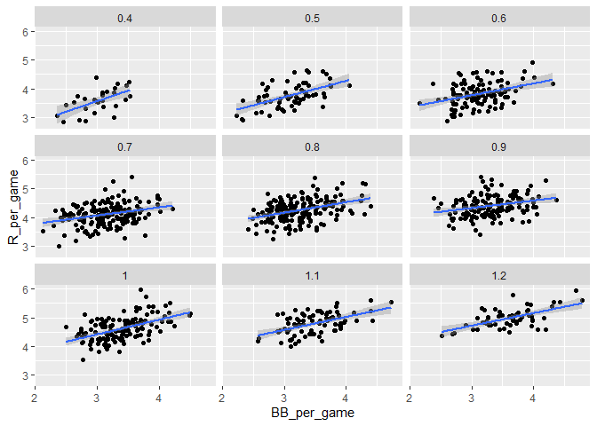
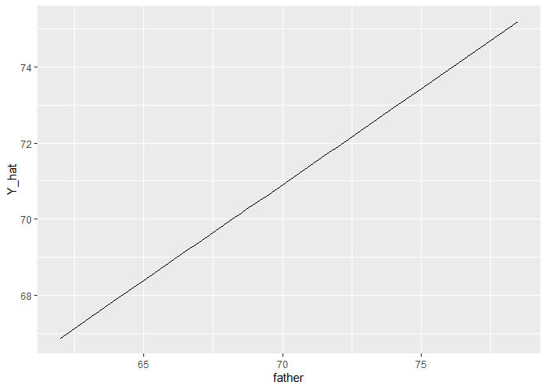
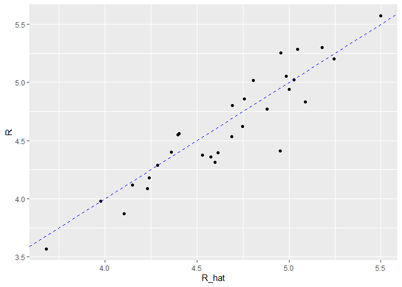

Introduction to Regression
================
PK (Kasidit) Ratanavijai
5/7/2019

# Introduction

## Apply Regression to real world problem

Learning statistic from books give you strong foundation but you are on
github so I guess you need something easy to understand and practical to
real world problems. What could be a better way to learn about statistic
concept than using real world example? I will be regression models to
understand and solve problem in sport industry, baseball.

Here we need to understand a bit about baseball terms.

  - Each team has 9 players who score the most runs win.
  - After the ninth batter hits, we start with the first again.
  - Each time they come to bat, we call it a plate appearance, PA. At
    each plate appearance, the other team’s pitcher throws the ball and
    you try to hit it.
  - The plate appearance ends with a binary outcome you either make an
    out, that’s a failure and sit back down, or you don’t, that’s a
    success and you get to run around the bases and potentially score a
    run.
  - Each team gets nine tries, referred to as innings, to score runs.
  - Each inning ends after three outs, after you’ve failed three times.
  - There are five ways you can succeed
      - First one is called a **base on balls**. This is when the
        pitcher does not pitch well and you get to go to first base.
      - A single is when you hit the ball and you get to first base.
      - A double is when you hit the ball and you go past first base to
        second.
      - Triple is when you do that but get to third.
      - A home run is when you hit the ball and go all the way home and
        score a run.

## Scope the problem

Now historically, the batting average has been considered the most
important offensive statistic. To define this average, we define a hit
and an at bat. Singles, doubles, triples, and home runs are hits. But
remember, there’s a fifth way to be successful, the base on balls. That
is not a hit.  
An at bat is the number of times you either get a hit or make an out,
**bases on balls** are excluded. **The batting average** is simply hits
divided by at bats. And it is considered the main measure of a success
rate.

So does a player with a high stolen base total help produce runs? Can we
use data size to determine if it’s better to pay for bases on balls or
stolen bases? One of the challenges in this analysis is that it is not
obvious

We do keep track of the number of runs scored by our player. But note
that if you hit after someone who hits many home runs, you will score
many runs. But these runs don’t necessarily happen if we hire this
player but not his home run hitting teammate. However, we can examine
team level statistics. How do teams with many stolen bases compare to
teams with few? How about bases on balls?

## Let examine the data

**Do teams that hit more home runs score more runs?**

We can use ggplot to help visualize the correlation with Home run and
runs. (guide to ggplot can be found on my repo here
:<https://github.com/pkms-uchi/How_to_ggplot_in_R>)

``` r
#load the basball statistic
library(Lahman)
#ggplot
Teams %>% filter (yearID %in% 1961:2001) %>%
  mutate(HR_per_game = HR/G , R_per_game = R/G) %>%
  ggplot (aes (HR_per_game, R_per_game)) +
  geom_point()
```

<!-- -->

The plot shows a very strong association teams with more home runs
tended to score more runs.

**What about relationship between stolen bases and wins.**

``` r
#ggplot
Teams %>% filter (yearID %in% 1961:2001) %>%
  mutate(SB_per_game = SB/G , R_per_game = R/G) %>%
  ggplot (aes (SB_per_game, R_per_game)) +
  geom_point()
```

<!-- -->

Here, the relationship is not as clear as the home runs and run.

**What about relationship between bases on balls and runs.**

``` r
#ggplot
Teams %>% filter (yearID %in% 1961:2001) %>%
  mutate(BB_per_game = BB/G , R_per_game = R/G) %>%
  ggplot (aes (BB_per_game, R_per_game)) +
  geom_point()
```

<!-- -->

Although the relationship is not as strong as it was for home runs, we
do see a pretty strong relationship here.

By definition, home runs cause runs, because when you hit a home run, at
least one run will score. Now it could be that home runs also cause the
bases on balls.

So it might appear that a base on ball is causing runs, when in fact,
it’s home runs that’s causing both. This is called **confounding**.

Linear regression will help parse all this out and quantify the
associations. Next, we will try to predict things like how many more
runs will the team score if we increase the number of bases on balls but
keep the home runs fixed. Regression will help us answer this question,
as well.

# Important concepts

## Correlation

We can start by explore by asking a very specific question how much of a
son’s height can predict with the parents height. We all know that
genetic from parent play a big role in height. That means when parents’s
heights go up, a son’s height tends to go up as well. But let examine
the data.

``` r
galton_heights %>%
  ggplot(aes(father,son)) + 
  geom_point()
```

<!-- -->

You can see the correlation between father’s height and son’s height. We
can use

to find correlation of two variables. Correlation is between \(-1\) and
\(1\) where \(0\) to \(1\) means positive correlation and \(-1\) to
\(0\) means negative correlation. Here is the formula for correlation
:


To see this connection, let’s plot the standardized heights against each
other, son versus father, with a line that has a slope equal to the
correlation. Where
:  


and


``` r
mu_x = mean(galton_heights$father)
mu_y = mean(galton_heights$son)
s_x = sd(galton_heights$father)
s_y = sd(galton_heights$son)
r= cor(galton_heights$father,galton_heights$son)
m = r * s_y /s_x
b = mu_y -m*mu_x

galton_heights %>%
  ggplot(aes(father,son)) + 
  geom_point(  )+
  geom_abline(intercept = b, slope = r,lty = 2,color = "red")
```

<!-- -->

**This line is what we call the regression line**

If there’s perfect correlation, we predict an increase that is the same
number of SDs. If there’s zero correlation, then we don’t use x at all
for the prediction of y.For values between 0 and 1, the prediction is
somewhere in between. If the correlation is negative, we predict a
reduction, instead of an increase.

we can derive a regression function finding Expected value of Y :
.
In this case,


we can plug in father’s height to find son’s height given father’s
height.

## Linear Models

### Stratification and Multivariate Regression

Let’s come back to our baseball example To try to determine if bases on
balls is still useful for creating runs, a first approach is to keep
home runs fixed at a certain value and then examine the relationship
between runs and bases on balls.

We can stratify home runs per game to the closest 10th. And then, we can
make a scatter plot for each strata. A scatterplot of runs versus bases
on balls.

Once we stratify by home runs, these slopes are substantially reduced.

``` r
data2 = Teams %>% 
  filter (yearID %in% 1961:2001) %>%
  mutate(HR_stra = round(HR/G,1), BB_per_game = BB/G, R_per_game = R/G) %>%
  filter (HR_stra >= 0.4 & HR_stra <= 1.2)
  
data2 %>%
  ggplot (aes (BB_per_game, R_per_game)) +
  geom_point()+
  geom_smooth(method = "lm") + 
  facet_wrap(~HR_stra)
```

<!-- -->

This model implies that if the number of home runs is fixed, we observe
a linear relationship between runs and bases on balls. And that the
slope of that relationship does not depend on the number of home runs.
Only the slope changes as the home runs increase.

### Least Squares Estimates (LSE)

For linear models to be useful, we have to estimate the unknown
parameters, the betas. we use the least squares equation to find the
values that minimize the distance of the fitted model to the data.

We use the Residual Sum of Squares
(RSS)  


Once we find the values that minimize the RSS,we call the values the
Least Squares Estimate, LSE.

``` r
#Let compute RSS predicting son from father height
model1 = lm(son~father , data = galton_heights) ; model1
```

    ## 
    ## Call:
    ## lm(formula = son ~ father, data = galton_heights)
    ## 
    ## Coefficients:
    ## (Intercept)       father  
    ##     35.7125       0.5028

``` r
#summary 
summary(model1)
```

    ## 
    ## Call:
    ## lm(formula = son ~ father, data = galton_heights)
    ## 
    ## Residuals:
    ##     Min      1Q  Median      3Q     Max 
    ## -5.9022 -1.4050  0.0922  1.3422  8.0922 
    ## 
    ## Coefficients:
    ##             Estimate Std. Error t value Pr(>|t|)    
    ## (Intercept) 35.71249    4.51737   7.906 2.75e-13 ***
    ## father       0.50279    0.06533   7.696 9.47e-13 ***
    ## ---
    ## Signif. codes:  0 '***' 0.001 '**' 0.01 '*' 0.05 '.' 0.1 ' ' 1
    ## 
    ## Residual standard error: 2.22 on 177 degrees of freedom
    ## Multiple R-squared:  0.2507, Adjusted R-squared:  0.2465 
    ## F-statistic: 59.23 on 1 and 177 DF,  p-value: 9.473e-13

The R function predict takes an lm object as input and returns these
predictions. We can see it here in this code which produces this plot.

``` r
galton_heights %>%
  mutate (Y_hat = predict(lm(son~ father, data = .))) %>%
  ggplot (aes(father,Y_hat))+
  geom_line()
```

<!-- -->

## Regression and Baseball

In trying to answer how well bases on balls predict runs, data
exploration led us to this
model.


where Yi is the runs per game, x1 is Bases on ball per game, and x2 is
home runs per game.

the code that fits the multiple regression model.

``` r
model3 = Teams %>%
  filter (yearID %in% 1961:2001) %>%
  mutate(BB = BB/G, HR = HR/G, R =R/G) %>%
  lm( R~BB + HR , data= .)
#see summary
summary(model3)
```

    ## 
    ## Call:
    ## lm(formula = R ~ BB + HR, data = .)
    ## 
    ## Residuals:
    ##      Min       1Q   Median       3Q      Max 
    ## -0.87325 -0.24507 -0.01449  0.23866  1.24218 
    ## 
    ## Coefficients:
    ##             Estimate Std. Error t value Pr(>|t|)    
    ## (Intercept)  1.74430    0.08236   21.18   <2e-16 ***
    ## BB           0.38742    0.02701   14.34   <2e-16 ***
    ## HR           1.56117    0.04896   31.89   <2e-16 ***
    ## ---
    ## Signif. codes:  0 '***' 0.001 '**' 0.01 '*' 0.05 '.' 0.1 ' ' 1
    ## 
    ## Residual standard error: 0.3484 on 1023 degrees of freedom
    ## Multiple R-squared:  0.6503, Adjusted R-squared:  0.6496 
    ## F-statistic: 951.2 on 2 and 1023 DF,  p-value: < 2.2e-16

Now, if we want to construct a metric to pick players, we need to
consider singles, doubles, and triples as well. Our linear model is the
following
:


with With x1, x2, x3, x4, x5 representing bases on balls per
game,singles per game, doubles per game, triples per game, and home runs
per game, respectively.

we can discover the least squared errors for the parameters with lm
funciton.

``` r
model4 = Teams %>%
  filter (yearID %in% 1961:2001) %>%
  mutate(BB = BB/G, HR = HR/G, R =R/G,
         singles = (H-X2B-X3B-HR) / G,
         doubles = X2B/G,
         triples = X3B/G) %>%
  lm( R~BB+ singles+ doubles + triples + HR , data= .)
#summary with tidy
tidy(model4)
```

    ## # A tibble: 6 x 5
    ##   term        estimate std.error statistic   p.value
    ##   <chr>          <dbl>     <dbl>     <dbl>     <dbl>
    ## 1 (Intercept)   -2.77     0.0862     -32.1 4.65e-157
    ## 2 BB             0.371    0.0117      31.6 1.81e-153
    ## 3 singles        0.519    0.0127      40.8 8.63e-217
    ## 4 doubles        0.771    0.0226      34.1 7.39e-171
    ## 5 triples        1.24     0.0768      16.1 2.14e- 52
    ## 6 HR             0.927    0.0250      37.1 1.29e-191

To see how well our metric actually predicts runs, we can predict the
number of runs for each team in 2002 using the function

to make the plot. Note that we did not use the 2002 year to create this
metric. We used data from years previous to 2002.

``` r
Model5=Teams %>% filter (yearID %in% 2002) %>%
  mutate(BB = BB/G, HR = HR/G, R =R/G,
         singles = (H-X2B-X3B-HR) / G,
         doubles = X2B/G,
         triples = X3B/G) %>%
  mutate(R_hat = predict(model4, newdata = .))
#Lets see the correlation between Run predicted and Run in 2012
Model5 %>%
  ggplot (aes(R_hat,R))+
  geom_point()+
  geom_abline(lty = 2,color = "blue")
```

<!-- -->

### Summary

Our model does quite a good job predicting runs for 2002, as
demonstrated by the fact that points from the observed versus predicted
plot fallclose to the identity line. So instead of using batting average
or just the number of home runs as a measure for picking players, we can
use our fitted model to form a more informative metric that relates more
directly to run production.
