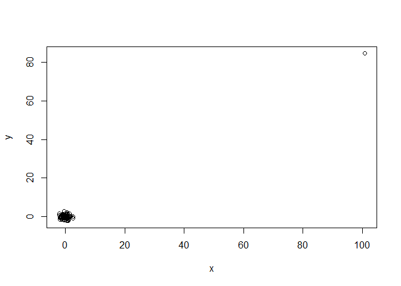

Confounding : Avoid misinterpret correlation
================
PK (Kasidit) Ratanavijai
10/11/2019

# Introduction

**Correlation is not causation** In 1.Regression model we described
tools for quantifying associations between variables, but we must be
careful not to over interpret these associations. There are many reasons
that a variable x can correlate with a variable y, without either being
a cause for the other.

## The first type is **Spurious corelation**.

For example, US spending on science, space and technology is highly
correlated with US Suicides by hanging. Does this mean this two
variables correlated? NO.


## Outlier

Outlier can significantly influence correlation between two independent
variable, x and y.

``` r
#let simulate the date by scale one point up
set.seed(55)
x = rnorm (100,100,1)
y = rnorm (100,84,1)
x[-23] = scale(x[-23])
y[-23] = scale(y[-23])
# lets plot it
plot(x,y)
```

<!-- -->

``` r
#correlation
cor(x,y)
```

    ## [1] 0.9875956

The correlation between x and y is 0.98, because that outlier pull the
effects.  
We can solve this problem in 2 ways.

  - find the outliers and remove them
  - Use Spearman correlation instead. Spearman compute the rank of data
    and help reduce the effect of outliers.

In R, we can simply use
.
In this case the Spearman correlation is -0.05 which is much closer to
0.

# Reference

Spurious corelation. :
<https://www.tylervigen.com/spurious-correlations>
